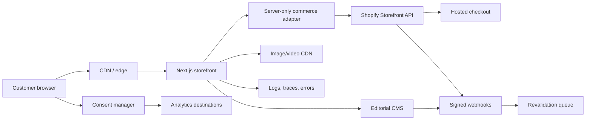

# CHAKSU Technical Requirements Document

**Status:** Architecture baseline v1.0  
**Related:** `PRD.md`, `web flow.md`, `parallax scrolling effect.md`, `UI UX design Brief.md`, `Typography.md`, `Implementation.md`

## 1. Architecture decision

Build CHAKSU as a headless storefront with a server-rendered application, a dedicated commerce system of record, an editorial CMS, and hosted checkout.

### Recommended production baseline

| Layer | Choice | Decision rationale |
| --- | --- | --- |
| Web application | Next.js 16 App Router, React 19.2, TypeScript strict mode | Server Components and route-level rendering keep commerce pages crawlable while isolating interactive motion. |
| Commerce | Shopify Storefront API pinned to `2026-04`; Shopify Admin for products/orders; hosted checkout | Mature product, inventory, promotion, order, and checkout operations without handling card data. |
| Editorial CMS | Sanity or an equivalent structured headless CMS | Story-rich pages, credits, release modules, and art direction need stronger modeling than hard-coded pages. |
| Styling | CSS variables + CSS Modules; optional utility classes for layout only | Preserves a bespoke visual system and avoids coupling the identity to a UI framework. |
| Motion | Small internal motion engine using `requestAnimationFrame`, `IntersectionObserver`, and transforms; no always-on animation framework by default | The reference experience needs precise motion, but the commerce route must stay light and accessible. |
| Hosting | Vercel for application runtime and edge/CDN, or an equivalent Next.js-compatible host | Preview deployments, image delivery, edge caching, and rollback. |
| Media | Commerce/CMS asset CDN with build-time responsive derivatives | One source asset produces AVIF/WebP/JPEG variants and safe focal-point crops. |
| Monitoring | Sentry-compatible error tracing plus host logs and synthetic checks | Frontend, server, checkout-handoff, and webhook visibility. |
| Analytics | Consent-aware GA4-compatible commerce analytics plus a product analytics layer | Marketing attribution and behavioral analysis remain separate but share an event contract. |
| CI/CD | GitHub Actions-compatible pipeline | Repeatable lint, type, unit, integration, visual, accessibility, and performance gates. |

Use the latest patched release within the selected major only after automated regression passes. Do not use unpinned `latest` tags in production. The official Next.js documentation currently recommends App Router and lists Node.js 20.9 as the minimum; the project should use a supported Node LTS and pin it in the repository. Shopify API calls must pin the documented `2026-04` version rather than silently following an unstable default.

Official references:

- Next.js App Router: <https://nextjs.org/docs/app>
- Next.js installation/system requirements: <https://nextjs.org/docs/app/getting-started/installation>
- Next.js 16 upgrade notes: <https://nextjs.org/docs/app/guides/upgrading/version-16>
- Shopify Storefront API 2026-04: <https://shopify.dev/docs/api/storefront/2026-04>

### Alternative platform decision

If CHAKSU requires complex Indian payment, ERP, warehouse, or custom-return behavior not supported by the merchant's Shopify configuration, keep the frontend contract and replace only the commerce adapter. Do not create custom order/payment infrastructure before the operational gap is verified.

## 2. System context



### Trust boundaries

- Storefront and CMS public content are untrusted inputs at render time and must be sanitized/validated.
- Storefront API tokens are server-only unless Shopify explicitly designates a public-scoped token; sensitive Admin tokens never reach the browser.
- Checkout owns payment data. CHAKSU never stores PAN/card details.
- Webhooks are accepted only after signature verification, timestamp tolerance, idempotency checks, and rate limiting.
- Analytics loads by consent category and receives no raw payment, password, or sensitive fit-support text.

## 3. Repository structure

```text
chaksu-storefront/
├─ app/
│  ├─ (commerce)/
│  │  ├─ collections/[handle]/page.tsx
│  │  ├─ products/[handle]/page.tsx
│  │  ├─ search/page.tsx
│  │  └─ cart/page.tsx
│  ├─ (editorial)/
│  │  ├─ stories/[slug]/page.tsx
│  │  └─ about/page.tsx
│  ├─ api/
│  │  ├─ revalidate/route.ts
│  │  ├─ fit-help/route.ts
│  │  └─ webhooks/[provider]/route.ts
│  ├─ layout.tsx
│  ├─ page.tsx
│  ├─ sitemap.ts
│  └─ robots.ts
├─ components/
│  ├─ commerce/
│  ├─ editorial/
│  ├─ motion/
│  ├─ navigation/
│  └─ primitives/
├─ lib/
│  ├─ commerce/
│  │  ├─ adapter.ts
│  │  ├─ shopify.ts
│  │  └─ mappers.ts
│  ├─ cms/
│  ├─ analytics/
│  ├─ consent/
│  ├─ security/
│  └─ validation/
├─ styles/
│  ├─ tokens.css
│  ├─ reset.css
│  └─ globals.css
├─ tests/
│  ├─ unit/
│  ├─ integration/
│  ├─ e2e/
│  ├─ a11y/
│  └─ visual/
├─ public/
│  ├─ fonts/
│  └─ media/
├─ instrumentation.ts
├─ next.config.mjs
└─ package.json
```

## 4. Rendering and caching strategy

| Route type | Rendering | Cache behavior | Invalidation |
| --- | --- | --- | --- |
| Home | Static shell + cached CMS/commerce blocks | Short release-aware cache | CMS/product webhook + manual publish |
| Collection | Server-rendered with cached base data; URL filters | Cache unfiltered/curated states; dynamic query states | Product/collection webhook |
| PDP | Server-rendered product shell | Cached product data; inventory freshness strategy | Product/inventory webhook; conservative TTL |
| Story/About | Static or incremental | Long cache | CMS publish webhook |
| Search | Dynamic server request | Short/no shared cache for query | Not applicable |
| Cart | Client state backed by commerce cart API | Private/no-store | Customer actions |
| Account | Dynamic authenticated | Private/no-store | Customer actions |

### Rules

- Never cache personalized cart/account responses in a shared cache.
- Do not display inventory urgency from stale cached values.
- Product pages may cache descriptive content while variant availability is refreshed independently.
- Use tag-based revalidation and idempotent webhook processing.
- Define stale-while-revalidate behavior explicitly per domain object.
- Failed CMS or recommendation requests must degrade without blocking product purchase.

## 5. Domain models

### Product

```ts
type Product = {
  id: string;
  handle: string;
  title: string;
  subtitle?: string;
  description: PortableText | string;
  role: 'core' | 'signature' | 'culture';
  franchise?: string;
  priceRange: MoneyRange;
  variants: ProductVariant[];
  media: ProductMedia[];
  fit: FitProfile;
  material: MaterialProof;
  construction: ConstructionProof[];
  climateTags: Array<'heat-friendly' | 'transitional' | 'cold-weather'>;
  care: CareInstruction[];
  origin: string;
  deliveryPolicyRef: string;
  returnPolicyRef: string;
  completeTheFit: string[];
  seo: SeoFields;
};
```

### Product variant

```ts
type ProductVariant = {
  id: string;
  sku: string;
  color: string;
  size: string;
  availableForSale: boolean;
  quantityAvailable?: number;
  price: Money;
  compareAtPrice?: Money;
  selectedOptions: Array<{ name: string; value: string }>;
};
```

### Proof objects

- `FitProfile`: fit name, garment measurements, measurement diagram, model records, fit notes, stretch, movement video.
- `MaterialProof`: composition, weight/GSM if relevant, weave/knit, hand feel, breathability context, test notes.
- `ConstructionProof`: label, description, macro media, technique, workshop/origin credit.
- Publication is blocked when required structured proof fields are absent.

### Editorial story

- Title, dek, slug, cover media, theme, release relation, chapters.
- Chapter blocks: text, image, video, quote, split media, product reference, credits, footnotes.
- Rights owner, usage expiry, creator credits, alt text, focal point, reduced-motion fallback.

### Policy summary

One structured object per policy with effective date, concise summary, detailed body, exceptions, country/region, and commerce-platform reference. PDP/cart/help must render from the same source.

## 6. Commerce integration

### Storefront operations

- Fetch products, collections, variants, availability, prices, menus, cart, customer-safe data, and checkout URLs through typed GraphQL operations.
- Generate types from the pinned GraphQL schema in CI.
- Persist carts with the platform cart ID in a secure, appropriately scoped cookie or browser storage; do not expose secrets.
- Merge anonymous and authenticated carts according to documented product behavior.
- Validate price and availability server-side immediately before checkout handoff.

### Checkout handoff contract

Required inputs: cart lines, variant IDs, quantities, discount codes, buyer locale, attribution parameters, and allowed customer identity fields.

Required return: checkout URL and correlation ID. Persist a first-party checkout-start event before navigating. Purchase completion comes from a platform webhook and/or supported checkout return mechanism; never infer purchase from a button click.

### Webhooks

Handle at minimum:

- Product create/update/delete.
- Collection/menu update.
- Inventory update if available and operationally useful.
- Order create/paid/fulfilled/cancelled/refunded.
- CMS publish/unpublish.

Processing sequence: verify → parse with schema → derive idempotency key → enqueue/perform bounded action → record outcome → respond quickly. Expensive work must not block acknowledgment.

## 7. API and server routes

| Route | Method | Purpose | Protection |
| --- | --- | --- | --- |
| `/api/revalidate` | POST | CMS/commerce cache invalidation | HMAC/signature, allowlist where feasible, rate limit |
| `/api/webhooks/shopify` | POST | Commerce events | Raw-body signature verification, idempotency |
| `/api/webhooks/cms` | POST | Editorial events | Provider signature, schema validation |
| `/api/fit-help` | POST | Consent-aware support handoff | CSRF/origin validation, rate limit, input minimization |
| `/api/analytics` | POST optional | First-party event relay | Consent state, schema validation, abuse controls |

All public endpoints return generic errors and a correlation ID. Detailed failures stay in logs.

## 8. Frontend component contracts

### Server-first components

Use Server Components for navigation data, collection shells, product descriptions, story blocks, recommendations, policy summaries, metadata, and structured data.

### Client components

Limit client boundaries to:

- Mega-menu/drawer interaction.
- Variant selector.
- Cart state.
- Filter controls.
- Media gallery.
- Wishlist/account affordances.
- Motion controllers.
- Consent UI.
- Analytics dispatch.

No page should become a single client component.

### Primitive requirements

Button, link, input, select/listbox, accordion, dialog, drawer, tabs, toast, quantity input, price, image, video, focus trap, and visually-hidden helpers must have documented accessibility behavior and automated tests.

## 9. Media pipeline

### Images

- Store an original master, focal point, rights metadata, alt text, and crop intent.
- Generate AVIF and WebP, with JPEG/PNG only as fallbacks or where transparency/compatibility requires it.
- Use width descriptors appropriate to 360, 768, 1024, 1440, and 1920 layouts.
- Product color accuracy requires an approved color-managed export and visual QA.
- Avoid client-side delivery of images larger than the rendered box needs.

### Video

- Hero loop target: 6-10 seconds, muted, no audio dependency, optimized MP4/WebM, poster-first.
- First-load video ceiling: 3 MB; defer beyond poster and intent.
- Long editorial films require click-to-play, captions, transcript, and adaptive streaming where justified.
- Never ship the 163 MB reference capture as a production asset.

### Generated hero asset

`Visual Background UI Image.png` is the art-direction baseline. Production should reshoot the concept with contracted creators and documented rights if photography is needed for commercial launch.

## 10. Parallax implementation requirements

- Read scroll position once per animation frame and batch DOM writes.
- Animate only `transform` and `opacity`; do not animate layout properties.
- Use one shared controller and passive listeners, not one listener per element.
- Cap vertical translation at 12% of element height or 120 px, whichever is smaller.
- Stop work outside an expanded viewport using `IntersectionObserver`.
- Disable non-essential motion for reduced motion, save-data, low-power heuristics, and low-end performance profiles.
- Content must be complete and correctly ordered without JavaScript.
- Never pin the page in a way that traps keyboard or touch scrolling.

Implementation details live in `parallax scrolling effect.md`.

## 11. Performance budgets

| Budget | Target |
| --- | --- |
| LCP p75 mobile | ≤2.5 s |
| INP p75 mobile | ≤200 ms |
| CLS p75 | ≤0.1 |
| Initial JS | ≤180 KB gzip, excluding consented optional vendors |
| Initial CSS | ≤60 KB gzip |
| Hero still | ≤220 KB mobile; ≤400 KB desktop |
| Critical fonts | ≤120 KB total WOFF2 for initial Latin subset |
| Initial autoplay video | ≤3 MB and never blocks LCP |
| Third-party main-thread time | ≤200 ms in first 5 s on reference mobile profile |

### Performance enforcement

- Lighthouse CI on representative routes with fixed budgets.
- WebPageTest or equivalent on Indian 4G and mid-tier Android profiles.
- Real-user Web Vitals segmented by device, geography, route, and release.
- Bundle analyzer gate and dependency review for any increase over 10 KB gzip.

## 12. Accessibility requirements

- WCAG 2.2 AA target and documented manual audit.
- Logical source order independent of visual grid placement.
- Native elements before custom ARIA components.
- Mega-menu uses buttons for disclosure, Escape close, focus return, and no hover-only access.
- Variant selectors expose selected, unavailable, low-stock, and validation states programmatically.
- Cart updates use polite live regions; critical errors receive focus.
- Videos have pause, captions where meaningful, and no flashing content.
- `prefers-reduced-motion` produces a still, non-parallax layout; no content disappears.
- Automated axe checks plus manual screen-reader, keyboard, zoom, reflow, and touch testing.

## 13. SEO and discoverability

- Server-rendered unique title, description, canonical, Open Graph, and social images.
- Product, Offer, AggregateRating where valid, BreadcrumbList, Organization, and Article JSON-LD.
- Never emit review or inventory structured data that is not visible and current.
- XML sitemaps split by products, collections, stories, and static pages.
- Indexable curated filter pages only; canonicalize or noindex uncontrolled faceted combinations.
- Human-readable URLs, redirects for changed handles, and 404/410 handling.
- Alt text describes product and editorial purpose; filenames are not alt text.
- Stories link to related products; products link to relevant stories without link farms.

## 14. Security and privacy

### Browser and transport

- HTTPS only, HSTS, secure cookies, `SameSite` policy, no mixed content.
- Content Security Policy with nonces/hashes; restrict script, connect, frame, media, and image sources.
- `frame-ancestors`, `Referrer-Policy`, `Permissions-Policy`, MIME sniffing protection, and safe cross-origin headers.
- Sanitize CMS rich text and prohibit arbitrary executable embeds.

### Application

- Validate all external data using runtime schemas.
- Escape output by default; no unsanitized HTML.
- CSRF/origin checks on state-changing first-party routes.
- Rate limit support, webhook, revalidation, and auth-adjacent endpoints.
- Secrets in managed secret storage, rotated and scoped by environment.
- Dependency scanning, lockfile integrity, secret scanning, and security review before launch.

### Privacy

- Consent categories: necessary, analytics, marketing, personalization.
- No analytics/marketing SDK before consent where legally required.
- Data inventory with owner, purpose, retention, processor, and deletion path.
- Fit-help conversations collect only what is required and define retention.
- Customer-fit media requires explicit rights and deletion workflow.

## 15. Observability

### Logs

Structured JSON with timestamp, environment, route, request/correlation ID, deployment ID, provider, duration, status, and safe error code. Do not log tokens, addresses, passwords, full customer messages, or payment data.

### Metrics

- Route latency/error rate.
- Storefront API latency/error/throttle state.
- CMS latency/error.
- Checkout handoff success.
- Webhook verify/process/retry/dead-letter counts.
- Cache hit/revalidation outcome.
- Real-user Web Vitals.
- Client error sessions and affected route/deployment.

### Alerts

Define severity, owner, response expectation, and runbook for storefront outage, checkout-handoff failure, elevated API errors, webhook backlog, inventory mismatch, and Core Web Vitals regression.

## 16. Testing strategy

| Level | Coverage |
| --- | --- |
| Unit | Mappers, money, availability, proof completeness, policy summaries, analytics schemas, motion math. |
| Component | Navigation, variant selector, gallery, cart, filters, accordions, consent. |
| Integration | Shopify queries, CMS mappings, webhook verification, revalidation, cart lifecycle. |
| E2E | Browse → PDP → size → cart → checkout handoff; search; filters; sold out; return path; account. |
| Visual | Home/PLP/PDP/story/cart at key breakpoints and light/dark media states. |
| Accessibility | axe plus manual keyboard, screen reader, zoom, reduced motion, high contrast. |
| Performance | Lighthouse CI, production synthetic tests, real-user monitoring. |
| Security | Header/CSP checks, endpoint abuse cases, webhook replay, dependency/secret scans. |

Test fixtures must include: no image, one/many variants, sold out, price change, invalid compare-at price, missing proof field, long title, Tamil text, no reviews, many reviews, slow API, failed CMS, unavailable pincode, and expired editorial media rights.

## 17. Environment and deployment

Environments: local, preview per pull request, staging connected to test data, and production. Production secrets and customer data never appear in preview.

Required configuration groups:

- Commerce domain/API version/storefront token/webhook secret.
- CMS project/dataset/read token/webhook secret.
- Application URL and checkout allowlist.
- Monitoring DSN/environment/release.
- Analytics IDs and consent configuration.
- Support/fit-help destination and operating-hours content.

Deployment sequence: migrate schema → validate content → build/test → preview approval → deploy application → smoke test → enable traffic → monitor. Rollback must not require a code edit.

## 18. Technical definition of done

- Typed, version-pinned integrations with no leaked secrets.
- Complete production data paths for every live SKU.
- Passing lint, types, unit, integration, E2E, accessibility, visual, performance, and security gates.
- Verified sandbox and production-like checkout flows.
- Consistent policy and pricing behavior.
- Documented runbooks, ownership, backup/export procedures, and rollback.
- Real-user monitoring and purchase reconciliation operational on launch day.
- No essential content or purchase action depends on parallax, hover, autoplay, or a third-party analytics script.
