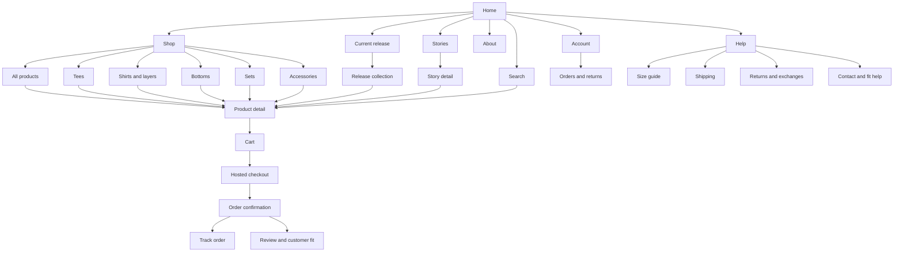
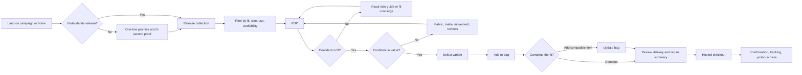
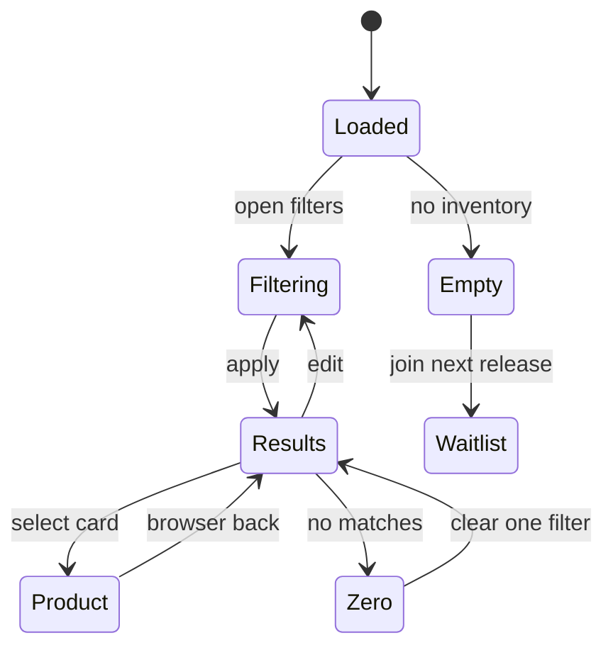
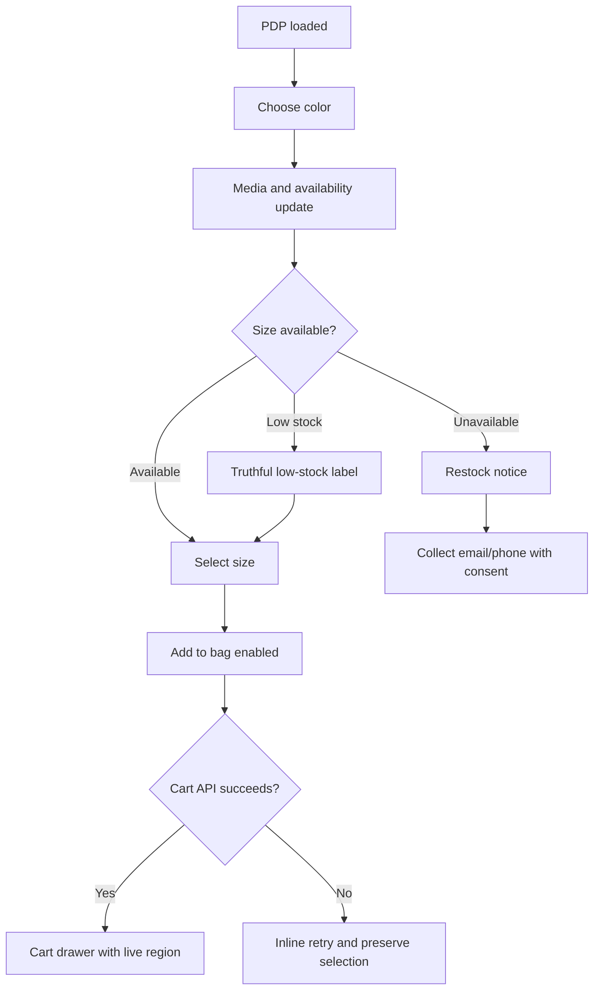
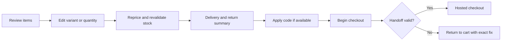
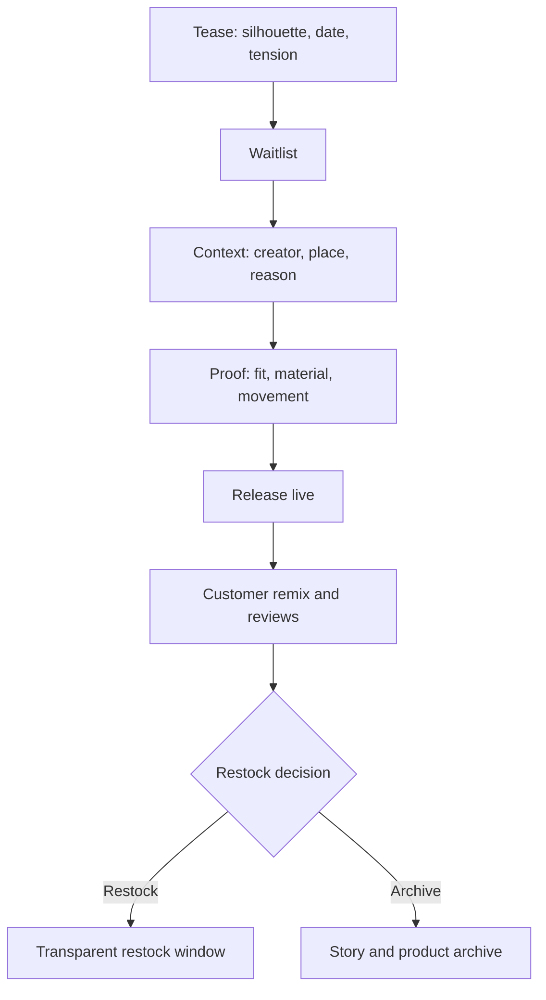
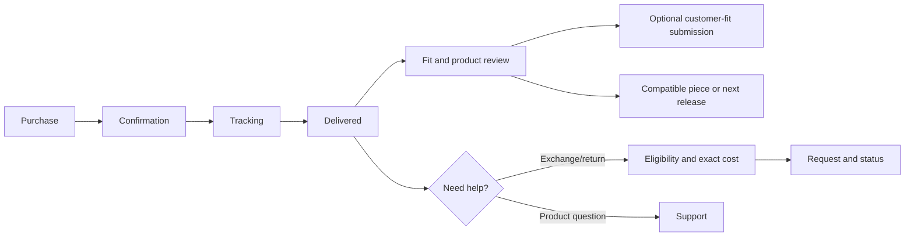

# CHAKSU Web Flow

## 1. Experience model

CHAKSU uses a two-speed journey:

1. **Desire mode:** cinematic entry, release story, people, movement, and the CHAKSU typographic system.
2. **Decision mode:** edited discovery, fit and material proof, delivery certainty, and a fast hosted checkout.

The handoff between the two must be visible. The shopper should never wonder whether they are in an art experience or a store.

## 2. Sitemap



## 3. Primary conversion flow



### Key handoffs

- **Hero → shop:** Scroll cue and CTA reach the same current release. No generic “explore” dead end.
- **Story → product:** Product links sit after a meaningful story beat and preserve the story in back navigation.
- **PLP → PDP:** Applied filters and scroll position restore when the user returns.
- **PDP → support:** Product, color, size, and consented measurements prefill the fit-help context.
- **Cart → checkout:** Price, discounts, product, variant, attribution, and policy summary remain consistent.
- **Checkout → account:** Guest purchase remains valid; account creation is optional after confirmation.

## 4. Home flow

### Section sequence

1. **Cinematic release hero**
   - CHAKSU wordmark.
   - Release title and one-line proposition.
   - `Shop the release` primary CTA.
   - `Watch / read the story` secondary link.
   - Scroll cue and media pause.
2. **Release edit**
   - Four products maximum above the first editorial break.
   - One complete-fit card spans two grid cells.
3. **Product proof interruption**
   - Three statements: fit, material, make.
   - Direct link to the proof-rich hero PDP.
4. **Movement story**
   - Parallax editorial image and creator context.
   - No more than 80-120 words before a clear continuation.
5. **Shop by intent**
   - “Complete set,” “Daily signal,” “After dark,” and “Entry piece.”
   - Intent labels are editable and validated with customers.
6. **Customer/creator proof**
   - Customer fits, creator credits, review excerpts with product links.
7. **Journal/story cards**
   - Two or three strong pieces, not an infinite news feed.
8. **Owned-audience entry**
   - Release access, restock notice, or city event—not a generic newsletter promise.
9. **Footer**
   - Help, policies, store/contact, socials, accessibility, locale, and consent settings.

### Home failure states

- Hero video fails: poster image, copy, CTA, and pause control remain correct.
- CMS module fails: omit the nonessential module; do not leave an empty gap.
- Current release is sold out: hero CTA becomes `View the archive` plus `Join next release`.
- No customer proof yet: show process proof, not fabricated testimonials.

## 5. Navigation flow

### Desktop

```text
CHAKSU | NEW RELEASE | SHOP | STORIES | ABOUT                 SEARCH | ACCOUNT | BAG
```

- `Shop` opens an editorial mega-menu.
- Left column: categories and release status.
- Right area: at most two labeled visual links.
- Menu opens on click and optional deliberate hover; click behavior is authoritative.
- Escape closes; focus returns to trigger; moving pointer between trigger and menu does not collapse it unexpectedly.

### Mobile

- Header: menu, centered wordmark, search, bag.
- Full-height drawer with categories first, stories/about second, help/account last.
- Nested category panels preserve a visible back action.
- The drawer does not scroll the page behind it.

## 6. Collection flow



### Collection page anatomy

1. Collection title, one-sentence context, optional release media.
2. Result count, sort, filter, and current filter chips.
3. Product grid with controlled editorial interruptions.
4. Load-more pagination; avoid infinite scroll that destroys footer and back-position reliability.
5. End state: next release or story, not repeated product recommendations.

### Filter behavior

- Mobile filter opens a bottom sheet/full-height panel with result count.
- Desktop filter may expand inline or use a side panel without shifting product card widths unexpectedly.
- Apply state is reflected in URL parameters.
- `Clear all` is always available when filters exist.
- Size means purchasable size, not catalog metadata.
- Climate/use tags explain their criteria.

## 7. Product detail flow

### Desktop anatomy

```text
┌──────────────────────────────────────┬──────────────────────────────┐
│ Large product and movement media     │ Product name / price         │
│ Scrollable; mixed wide/detail crops  │ Color                         │
│                                      │ Size + guide                  │
│                                      │ Add to bag / buy now          │
│                                      │ Delivery + returns summary    │
│                                      │ Fit / material / make         │
└──────────────────────────────────────┴──────────────────────────────┘
                           ↓
               reviews → customer fits → complete the fit
```

The purchase rail stays sticky only while its content fits the viewport. If it becomes taller than the viewport, it returns to normal flow or gains a deliberate internal strategy that does not trap the user.

### Mobile anatomy

1. Swipeable media with thumbnails/count and video play control.
2. Name, price, tax note, color.
3. Size selector and fit guide.
4. Primary add-to-bag.
5. Pincode/delivery and returns summary.
6. Proof accordions with open-first essentials.
7. Reviews/customer fits.
8. Complete-the-fit.

### Variant state flow



### Fit-help flow

1. `Find my size` opens guidance before collecting personal data.
2. Customer chooses visual comparison, measurement guide, or fit concierge.
3. Concierge explains hours and consent.
4. Prefill product/variant; ask only height, usual size, preference, and optional measurements.
5. Handoff to WhatsApp/onsite support with a customer-visible summary.
6. Return link opens the same PDP/variant.

## 8. Cart and checkout flow

### Cart drawer

- Opens after successful add.
- Focus moves to the drawer heading; closing returns to the initiating control.
- Shows product, variant, quantity, price, delivery estimate, and edit/remove.
- Offers at most two compatible items.
- Actions: `Checkout` and `View bag`.

### Full cart



### Checkout exception handling

- Inventory changed: identify the affected line and preserve all other items.
- Price changed: show old/new price and require acknowledgement.
- Discount invalid: explain eligibility without deleting cart.
- Payment failure: provider checkout handles retry; CHAKSU preserves a support route.
- Checkout abandoned: reminders require prior consent and must deep-link to a recoverable cart.

## 9. Search flow

1. Search opens with suggested categories and current release.
2. Results update after a short debounce and support keyboard navigation.
3. Results group products, collections, and stories.
4. Submitting opens a full results page with filters.
5. Zero results show spelling recovery, synonyms, categories, and support.

Search terms become product insight only after privacy review and retention rules.

## 10. Story and drop flow



Every state maps to actual inventory and an editable release status. Never imply a finite edition unless quantity and restock rules support the claim.

## 11. Account and post-purchase flow



Guest users can track and manage an order using secure order verification without being forced to create an account.

## 12. Accessibility flow rules

- Skip link targets main content.
- Breadcrumbs identify position on collection, PDP, story, and help pages.
- All drawers/dialogs trap focus, close on Escape, restore focus, and have accessible names.
- Product grid source order matches reading order even when cards visually span columns.
- Filter/result changes are announced without stealing focus.
- Error summaries link to invalid fields.
- Motion never changes reading order or hides information from non-visual users.
- Reduced-motion users follow the exact same decision flow with static imagery.

## 13. Analytics checkpoints

| Journey stage | Required signals |
| --- | --- |
| Discover | Landing context, campaign, hero view, CTA, scroll depth with consent. |
| Browse | Collection, filter, sort, search, card exposure/click. |
| Believe | Fit guide, proof module, movement video, pincode, reviews. |
| Buy | Variant, add, cart edit, complete-fit attach, checkout start. |
| Receive | Fulfillment events, delivery accuracy, support contact. |
| Return | Reason, eligibility, status, resolution time. |
| Re-enter | Review, customer fit, restock, next release, repeat order. |

## 14. Experience acceptance tests

1. A new visitor states what CHAKSU sells and why it is different after five seconds on home.
2. A user reaches a purchasable size from home in three meaningful decisions or fewer.
3. Browser back from PDP restores filters and approximate scroll position.
4. A sold-out variant never allows checkout and offers a valid restock path.
5. Price, delivery, and returns do not contradict between PDP, cart, checkout, help, or confirmation.
6. Keyboard and screen-reader users complete the entire pre-checkout journey.
7. Reduced-motion mode reveals all content with no blank pinned sections.
8. Slow or failed noncritical services do not block product discovery or checkout.
9. Guest customers can track and request eligible post-purchase support.
10. Every release state can be previewed before publication.
